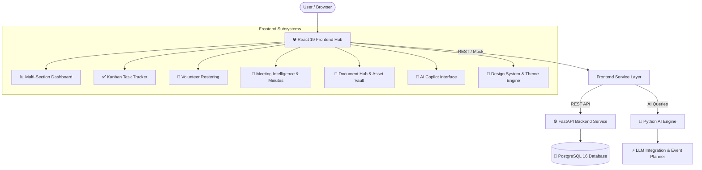

# ⚡ ClubOps AI

<div align="center">


**Next-Generation Autonomous Operations & Event Intelligence Platform for Clubs, Organizations & Campus Communities**

[](frontend/)
[](backend/)
[](ai/)
[](docker-compose.yml)
[](frontend/)
[](LICENSE)

[Architecture](#-monorepo-architecture) • [Services](#-services-breakdown) • [Quick Start](#-quick-start-guide) • [Core Capabilities](#-core-platform-capabilities) • [Meeting Intelligence](#-meeting-intelligence--action-item-pipeline) • [Document Vault](#-document-hub--asset-vault) • [Demo Logins](#-demo-login-accounts)

</div>

---

## 📖 Overview

**ClubOps AI** is an end-to-end intelligent operations platform engineered to eliminate operational friction across collegiate clubs, student societies, hackathon organizers, and community organizations.

It bridges event planning, volunteer coordination, Kanban task execution, meeting intelligence & action item extraction, document management, risk governance, and executive decision-making — augmented with AI copilots and real-time operational analytics.

---

## 🏛️ Monorepo Architecture

```text
ClubOps-AI/
├── 🌐 frontend/          # React 19 web application (Vite, TypeScript, Tailwind CSS v4, Meeting, Volunteer & Document Subsystems)
├── ⚙️ backend/           # Core FastAPI REST backend & PostgreSQL integration
├── 🧠 ai/                # AI Engine: LLM integrations, Event Planner, validators & prompts
├── 🐳 docker-compose.yml # PostgreSQL 16 local database development environment
├── 📄 .env.example       # Global environment configuration template
└── 📖 README.md          # Monorepo documentation & quick-start guide
```



---

## 📦 Services Breakdown

| Service | Technology | Description | Documentation |
| :--- | :--- | :--- | :--- |
| **Frontend** | React 19, TypeScript 5.9, Vite 7.3, Tailwind CSS v4 | Executive operations command center, modular dashboard, Kanban tasks, volunteer management, meeting intelligence subsystem, document vault, risk matrix, and AI copilot interface. | [Frontend Guide](frontend/README.md) |
| **Backend** | Python 3.11, FastAPI, Uvicorn, PostgreSQL, SQLAlchemy | RESTful API endpoints for club governance, member authentication, event persistence, and operational records. | [Backend Guide](backend/README.md) |
| **AI Engine** | Python 3.11, Pydantic, LLM Client | Domain-specific LLM intelligence for event schedule generation, action validation, automated risk detection, and daily briefings. | [AI Engine Guide](ai/README.md) |
| **Database** | PostgreSQL 16 Alpine (Docker) | Containerized relational database for persistent club operations. | [docker-compose.yml](docker-compose.yml) |

---

## 🚀 Quick Start Guide

### 1. Clone the Repository
```bash
git clone https://github.com/jaiminrangpara17/ClubOps-AI.git
cd ClubOps-AI
```

### 2. Start PostgreSQL Database
```bash
docker compose up -d
```

### 3. Start the Frontend Application
```bash
cd frontend
npm install
npm run dev
```
The web dashboard will be available at `http://localhost:5173`.

### 4. Start the AI Engine Service
```bash
cd ai
python -m venv .venv
source .venv/bin/activate       # On Windows: .venv\Scripts\activate
pip install -r requirements-dev.txt
cp .env.example .env            # Configure LLM API key
uvicorn app.main:app --reload --port 8001
```
Interactive AI documentation will be available at `http://localhost:8001/docs`.

### 5. Start the Backend API
```bash
cd backend
python -m venv .venv
source .venv/bin/activate       # On Windows: .venv\Scripts\activate
pip install -r requirements.txt
uvicorn app.main:app --reload --port 8000
```
Interactive API documentation will be available at `http://localhost:8000/docs`.

---

## ⚡ Core Platform Capabilities

### 📊 1. Operations Command Dashboard (`/dashboard`)
- **Executive AI Briefing**: On-demand AI-generated operational digests summarizing event readiness, volunteer coverage gaps, and blocked dependencies.
- **Operational State Export**: One-click download of the complete operational state as structured JSON.
- **Resilient Multi-Section Architecture**: Independent asynchronous section fetching (`useSectionData`) prevents cascade page failures.
- **Real-Time KPI Cards**: Active tasks, volunteer headcount, pending permits, and open risks.

### 📝 2. Meeting Intelligence & Action Item Pipeline (`/events/:id/meetings`)
- **Meeting Lifecycle Management**: Schedule meetings, define agendas, track attendees, and log location/timeline details.
- **Transcript & Notes Ingestion**: Store meeting transcripts and unformatted meeting notes.
- **AI-Powered Intelligence Extraction**: Automatically extract **Key Decisions** and **Action Items** from meeting transcripts.
- **1-Click Task Creation**: Convert extracted action items directly into live operational tasks with assignees and due dates.

### 📁 3. Document Hub & Asset Vault (`/events/:id/documents`)
- **Centralized Event Repository**: Organize run-of-show decks, event schedules, permits, floor plans, and sponsorship collateral.
- **Multipart Upload Engine**: Dedicated file uploader with real-time percentage progress (`apiUpload`) and client-side format validation.
- **Rich Document Details**: Inspect file metadata, upload timeline, access tier permissions, and category tags.
- **Search & Quick Previews**: Real-time content filtering with dedicated preview slide-outs.

### 👥 4. Volunteer Management Subsystem (`/events/:id/volunteers`)
- **Directory & Rosters**: Search and filter by departmental role (Stage, Registration, Logistics, Safety, Media, Hospitality) and availability status (`Confirmed`, `Pending`, `Unavailable`).
- **Volunteer Detail Profiles**: Contact records, shift schedules, assigned tasks, and supervisor details.
- **Create & Edit Workflows**: Rapid onboarding and assignment modifications with optimistic UI cache updates.

### 📋 5. Task Tracker & Kanban Boards (`/events/:id/tasks`)
- **Dual-View Workflow**: Toggle between interactive Kanban columns (`To do`, `In progress`, `Blocked`, `Done`) and structured tabular views.
- **Prioritization Matrix**: Multi-tier priority system (`Critical`, `High`, `Medium`, `Low`) with assignees and due dates.
- **Urgent Action Queue**: Automatically surface blocked or overdue tasks across all active teams.

### 🛡️ 6. Risk & Hazard Register (`/events/:id/risks`)
- Severity matrix (High, Medium, Low) with likelihood indicators and mitigation action trackers.
- Predictive blocker detection and safety advisory logging.

### 🤖 7. AI Copilot Hub (`/events/:id/ai`)
- Grounded conversation interface answering operational queries from live event data with citation previews.

### 🎨 8. Design System & Foundations (`/foundation`)
- Semantic color tokens (`canvas`, `surface`, `brand`, `line`, `danger`, `warning`, `success`, `info`).
- **Dark Mode / Light Mode** theme switching with system preference detection and localStorage persistence.
- Complete UI atomic component suite (`Button`, `Badge`, `Card`, `StatCard`, `Input`, `Dropdown`, `Breadcrumb`, `Progress`, `EmptyState`, `ErrorState`, `LoadingState`).

---

## 🔑 Demo Login Accounts

| Role | Email | Password |
| :--- | :--- | :--- |
| **Event Head** | `rahul@clubops.dev` | `clubops2026` |
| **President** | `president@clubops.dev` | `clubops2026` |
| **Volunteer** | `volunteer@clubops.dev` | `clubops2026` |
| **Faculty Advisor** | `faculty@clubops.dev` | `clubops2026` |

---

## 🧪 Testing & Verification

```bash
# Verify Frontend Build
cd frontend
npm run build

# Run AI Service Test Suite
cd ../ai
pytest -v
```

---

## 📄 License

This project is licensed under the MIT License — see the [LICENSE](LICENSE) file for details.

<div align="center">
  <sub>Built with ❤️ for collegiate clubs, event organizers, and operational teams worldwide.</sub>
</div>
