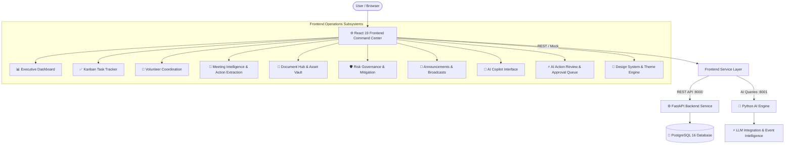

# 🚀 ClubOps AI — Intelligent Event Operations Platform

<div align="center">

[](https://reactjs.org/)
[](https://fastapi.tiangolo.com/)
[](https://www.python.org/)
[](https://www.typescriptlang.org/)
[](https://tailwindcss.com/)
[](https://www.postgresql.org/)
[](https://opensource.org/licenses/MIT)

**An end-to-end intelligent operations platform engineered to eliminate operational friction across collegiate clubs, student societies, hackathons, and event teams.**

[Architecture](#-monorepo-architecture) • [Core Subsystems](#-core-platform-subsystems) • [AI Review Queue](#-9-ai-action-approval--review-queue-eventsidai-actions) • [Quick Start](#-quick-start-guide) • [Demo Accounts](#-demo-login-accounts) • [Tech Stack](#-services-breakdown)

</div>

---

## 📖 Overview

**ClubOps AI** is a comprehensive, production-grade event operations and management platform designed specifically for university clubs, technical societies, hackathons, and community organizations. It unifies the entire event lifecycle into a single, high-performance command center:

- 📊 **Executive Command Dashboard** with AI-generated operational briefings and JSON state export.
- 📋 **Kanban Task Management** with multi-tier priorities and overdue action queues.
- 👥 **Volunteer Coordination** with shifts, attendance, and emergency assignments.
- 📝 **Meeting Intelligence** with transcript ingestion and 1-click action item extraction.
- 📁 **Document Asset Vault** with multipart progress uploads and category tagging.
- 🛡️ **Risk Governance Matrix** with severity scoring, mitigation tracking, and task linking.
- 📢 **Announcements & Broadcasts** with multi-channel targeting, pinned alerts, and read confirmations.
- 🤖 **AI Operations Copilot** with grounded context reasoning across event data and day-1 readiness audits.
- ⚡ **Human-in-the-Loop AI Action Review** with before/after diffs, one-click execution, and rejection auditing.
- 🎨 **Modern Design System** with dark/light theme switching and responsive mobile navigation.

---

## 🏛️ Monorepo Architecture

```text
ClubOps-AI/
├── 🌐 frontend/          # React 19 SPA (Vite 7, TypeScript 5.9, Tailwind CSS v4, Full Operations Suite)
├── ⚙️ backend/           # Core FastAPI REST backend, SQLAlchemy ORM & PostgreSQL integration
├── 🧠 ai/                # AI Engine: LLM agents, Event Planner, validators, prompts & briefings
├── 🐳 docker-compose.yml # PostgreSQL 16 local database development environment
├── 📄 .env.example       # Global environment configuration template
└── 📖 README.md          # Monorepo documentation & quick-start guide
```



---

## ⚡ Core Platform Subsystems

### 📊 1. Operations Command Dashboard (`/dashboard`)
- **Executive AI Briefing**: On-demand AI-generated operational digests summarizing event readiness, volunteer coverage gaps, and blocked dependencies.
- **Operational State Export**: One-click download of the complete operational state as structured JSON.
- **Resilient Multi-Section Architecture**: Independent asynchronous section fetching (`useSectionData`) prevents cascade page failures.
- **Real-Time KPI Cards**: Active tasks, volunteer headcount, pending permits, and open risks.

### 📢 2. Announcements & Broadcasts (`/events/:id/announcements`)
- **Multi-Channel Delivery**: Broadcast targeted updates to all attendees, organizing committees, volunteers, or faculty sponsors.
- **Priority Pinning & Badging**: High-visibility banners for urgent operational changes with read confirmation tracking.
- **Announcement Management**: Full create, edit, draft, and archive lifecycle with optimistic cache updates.

### 📝 3. Meeting Intelligence & Action Item Pipeline (`/events/:id/meetings`)
- **Meeting Lifecycle Management**: Schedule meetings, define agendas, track attendees, and log location/timeline details.
- **Transcript & Notes Ingestion**: Ingest unformatted transcripts and raw meeting minutes.
- **AI-Powered Intelligence Extraction**: Automatically parse **Key Decisions** and **Action Items** from raw notes.
- **1-Click Task Creation**: Seamlessly convert meeting action items into live operational tasks with assignees and due dates.

### 📁 4. Document Hub & Asset Vault (`/events/:id/documents`)
- **Centralized Event Repository**: Organize run-of-show decks, event schedules, permits, floor plans, and sponsorship collateral.
- **Multipart Upload Engine**: Dedicated file uploader with real-time percentage progress (`apiUpload`) and client-side format validation.
- **Rich Document Details**: Inspect file metadata, upload timeline, access tier permissions, and category tags.
- **Search & Quick Previews**: Real-time content filtering with dedicated preview slide-outs.

### 👥 5. Volunteer Coordination Subsystem (`/events/:id/volunteers`)
- **Directory & Rosters**: Search and filter by departmental role (Stage, Registration, Logistics, Safety, Media, Hospitality) and availability status (`Confirmed`, `Pending`, `Unavailable`).
- **Volunteer Detail Profiles**: Contact records, shift schedules, assigned tasks, and supervisor details.
- **Create & Edit Workflows**: Rapid onboarding and assignment modifications with optimistic UI cache updates.

### 📋 6. Task Tracker & Kanban Boards (`/events/:id/tasks`)
- **Dual-View Workflow**: Toggle between interactive Kanban columns (`To do`, `In progress`, `Blocked`, `Done`) and structured tabular views.
- **Prioritization Matrix**: Multi-tier priority system (`Critical`, `High`, `Medium`, `Low`) with assignees and due dates.
- **Urgent Action Queue**: Automatically surface blocked or overdue tasks across all active teams.

### 🛡️ 7. Risk & Hazard Governance (`/events/:id/risks`)
- **Risk Matrix**: Multi-dimensional severity (Critical, High, Medium, Low) and likelihood matrix.
- **Mitigation Action Linking**: Connect mitigation strategies directly to actionable tasks with assigned risk owners.
- **Status Lifecycle**: Open → Monitoring → Mitigated → Closed.

### 🤖 8. AI Copilot Hub (`/events/:id/ai`)
- **Grounded Event QA**: Context-aware queries across tasks, risks, and meeting logs.
- **Automated Drafting**: Draft agendas, risk summaries, volunteer briefings, and post-event retrospective reports.

### ⚡ 9. AI Action Approval & Review Queue (`/events/:id/ai/actions`)
- **Human-in-the-Loop Governance**: Review AI-suggested operational modifications with authoritative before/after diffs.
- **Multi-Entity Action Support**: Create tasks, update status/priority, assign volunteers, update risk status, and stage announcements.
- **Safe Execution & Audit Trail**: Approve actions to execute downstream mutations across module records or reject with recorded reasoning.

### 🎨 10. Design System & Theme Engine (`/foundation`)
- **Design Tokens**: Semantic color tokens (`canvas`, `surface`, `brand`, `line`, `danger`, `warning`, `success`, `info`).
- **Dark Mode / Light Mode**: System preference detection and instant manual switching.
- **Atomic UI Kit**: Complete suite of accessible primitive components (`Button`, `Badge`, `Card`, `StatCard`, `Input`, `Dropdown`, `Breadcrumb`, `Progress`, `EmptyState`, `ErrorState`, `LoadingState`).

---

## 📦 Services Breakdown

| Service | Technology | Description | Documentation |
| :--- | :--- | :--- | :--- |
| **Frontend** | React 19, TypeScript 5.9, Vite 7.3, Tailwind CSS v4 | Executive operations command center, modular dashboard, Kanban tasks, volunteer management, meeting intelligence, announcements, document vault, risk matrix, and AI copilot with action review. | [Frontend Guide](frontend/README.md) |
| **Backend** | Python 3.11, FastAPI, Uvicorn, PostgreSQL, SQLAlchemy | RESTful API endpoints for club governance, member authentication, event persistence, and operational records. | [Backend Guide](backend/README.md) |
| **AI Engine** | Python 3.11, Pydantic, LLM Client | Domain-specific LLM intelligence for event schedule generation, action validation, automated risk detection, and daily briefings. | [AI Engine Guide](ai/README.md) |
| **Database** | PostgreSQL 16 Alpine (Docker) | Containerized relational database for persistent club operations. | [docker-compose.yml](docker-compose.yml) |

---

## 🚀 Quick Start Guide

### 1. Clone the Repository
```bash
git clone https://github.com/jaiminrangpara17/ClubOps-AI.git
cd ClubOps-AI
```

### 2. Start PostgreSQL Database
```bash
docker compose up -d
```

### 3. Start the Frontend Application
```bash
cd frontend
npm install
npm run dev
```
The web dashboard will be available at `http://localhost:5173`.

### 4. Start the AI Engine Service
```bash
cd ai
python -m venv .venv
# On Windows:
.venv\Scripts\activate
# On macOS/Linux:
# source .venv/bin/activate
pip install -r requirements-dev.txt
cp .env.example .env            # Configure LLM API key
uvicorn app.main:app --reload --port 8001
```
Interactive AI documentation will be available at `http://localhost:8001/docs`.

### 5. Start the Backend API
```bash
cd backend
python -m venv .venv
# On Windows:
.venv\Scripts\activate
# On macOS/Linux:
# source .venv/bin/activate
pip install -r requirements.txt
uvicorn app.main:app --reload --port 8000
```
Interactive API documentation will be available at `http://localhost:8000/docs`.

---

## 🔑 Demo Login Accounts

| Role | Email | Password |
| :--- | :--- | :--- |
| **Event Head** | `rahul@clubops.dev` | `clubops2026` |
| **President** | `president@clubops.dev` | `clubops2026` |
| **Volunteer** | `volunteer@clubops.dev` | `clubops2026` |
| **Faculty Advisor** | `faculty@clubops.dev` | `clubops2026` |

---

## 🧪 Testing & Verification

```bash
# Verify Frontend Build
cd frontend
npm run build

# Run AI Service Test Suite
cd ../ai
pytest -v
```

---

## 🤝 Contributing

1. Fork the Project
2. Create your Feature Branch (`git checkout -b feature/AmazingFeature`)
3. Commit your Changes (`git commit -m 'feat: Add AmazingFeature'`)
4. Push to the Branch (`git push origin feature/AmazingFeature`)
5. Open a Pull Request

---

## 📄 License

This project is licensed under the MIT License — see the [LICENSE](LICENSE) file for details.

<div align="center">
  <sub>Built with ❤️ for collegiate clubs, event organizers, and operational teams worldwide.</sub>
</div>
